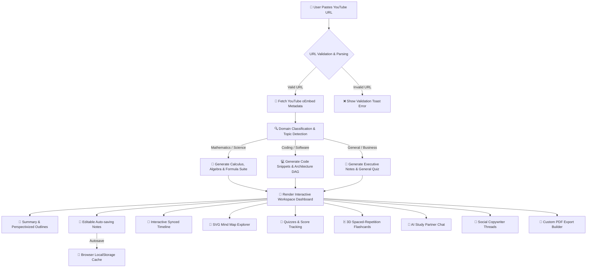
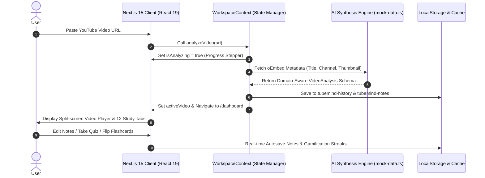

<div align="center">

# 🧠⚡ TubeMind AI

### *Transform Every YouTube Video into an Interactive Learning Experience*

[](https://nextjs.org/)
[](https://react.dev/)
[](https://www.typescriptlang.org/)
[](https://tailwindcss.com/)
[](LICENSE)
[](CONTRIBUTING.md)

<p align="center">
  <b>TubeMind AI</b> isn't just another video summarizer. It is an enterprise-grade, high-fidelity active learning platform designed to convert long educational YouTube lectures into structured study notes, flippable flashcards, interactive quizzes, SVG mind maps, social media threads, and executable code snippets—instantly.
</p>

[✨ Live Demo](#) • [📖 Documentation](#) • [🚀 Quick Start](#-quick-start) • [🤝 Contributing](CONTRIBUTING.md)

---

</div>

## 🌟 Key Features

| Feature | Description |
| :--- | :--- |
| **⚡ Instant AI Video Synthesis** | Paste any YouTube URL or YouTube Short to automatically extract metadata, transcripts, and domain insights. |
| **📑 Executive Summaries** | Toggle between **Short**, **Medium**, **Detailed**, **Bullet Points**, **Beginner**, and **Expert** summary perspectives. |
| **📝 Interactive Markdown Notes** | Live markdown editor with real-time autosave to `localStorage`, versioning history, and draft backups. |
| **📍 Interactive Chapter Timeline** | Jump directly to specific key moments in the video with synced timestamp navigation. |
| **🧠 Interactive SVG Mind Maps** | Zoomable, pannable, expandable visual DAG hierarchy representing key concepts and dependencies. |
| **🎯 Active Recall Quizzes** | Practice with MCQs, True/False, Fill-in-the-blanks, and Code challenges featuring live scoring & confetti celebrations. |
| **🃏 3D Flippable Flashcards** | Spaced repetition flashcards with difficulty filters (Easy/Medium/Hard) and bookmarking logic. |
| **💬 AI Study Partner Chat** | Context-aware chat partner equipped with suggested prompts, code blocks, and transcript query capabilities. |
| **📢 Social Copywriter** | Generate tailored LinkedIn posts (Professional, Startup, Developer, Funny) and multi-tweet Twitter threads. |
| **💻 Code Runner & Resources** | Automatically extracts code snippets with runnable simulated console output and resource citations. |
| **📄 Custom PDF Exporters** | Compile and export custom print-ready study notes into downloadable PDF documents. |
| **⏱️ Pomodoro Focus Timer** | Integrated focus clock rewarding study minutes with achievement unlocks and streak tracking. |
| **📲 PWA & Offline Support** | Installable Progressive Web App (PWA) with custom service worker caching and offline fallback layout. |

---

## 🔄 System Flowchart & User Journey

The flowchart below demonstrates how a YouTube URL is processed through TubeMind AI's pipeline:



---

## 🏗️ Architecture & Data Flow Diagram



---

## 💻 Tech Stack & Tools

- **Framework**: [Next.js 15.5](https://nextjs.org/) (App Router, Turbopack, Server Actions)
- **UI Core**: [React 19](https://react.dev/) + [TypeScript 5](https://www.typescriptlang.org/)
- **Styling**: [Tailwind CSS v4](https://tailwindcss.com/) with dark/light mode CSS tokens
- **Animations**: [Framer Motion](https://www.framer.com/motion/) physics & keyframe micro-interactions
- **Icons**: [Lucide React](https://lucide.dev/)
- **Charts & Effects**: [Canvas Confetti](https://github.com/catdad/canvas-confetti), [Fuse.js](https://fusejs.io/) fuzzy search
- **PWA**: Custom Service Worker (`public/sw.js`) and Manifest (`public/manifest.json`)

---

## 🚀 Quick Start

### Prerequisites
- Node.js `18.17.0` or higher
- npm `9.0.0` or higher

### Installation

1. **Clone the repository**:
   ```bash
   git clone https://github.com/YOUR_USERNAME/tubemind-ai.git
   cd tubemind-ai
   ```

2. **Install dependencies**:
   ```bash
   npm install --legacy-peer-deps
   ```

3. **Launch the development server**:
   ```bash
   npm run dev
   ```

4. **Open the browser**:
   Navigate to [http://localhost:3000](http://localhost:3000) to view the application.

---

## ⌨️ Global Keyboard Shortcuts

| Shortcut | Action |
| :--- | :--- |
| <kbd>Cmd</kbd> / <kbd>Ctrl</kbd> + <kbd>K</kbd> | Open Fuzzy Command Palette Search |
| <kbd>Alt</kbd> + <kbd>N</kbd> | Navigate to Notes Panel |
| <kbd>Alt</kbd> + <kbd>Q</kbd> | Navigate to Quiz Panel |
| <kbd>Alt</kbd> + <kbd>F</kbd> | Navigate to Flashcards Panel |
| <kbd>Alt</kbd> + <kbd>C</kbd> | Open AI Study Chat |
| <kbd>Esc</kbd> | Close Overlays & Search Dialogs |

---

## 📂 Project Structure

```text
tubemind-ai/
├── .github/
│   └── workflows/
│       └── deploy.yml          # Automated GitHub Pages CI/CD Pipeline
├── public/
│   ├── manifest.json           # PWA Manifest settings
│   └── sw.js                   # Service Worker offline cache
├── src/
│   ├── app/
│   │   ├── dashboard/          # Split-screen study workspace layout
│   │   ├── home/               # Video URL submission & history hub
│   │   ├── offline/            # PWA offline fallback UI
│   │   ├── globals.css         # Tailwind v4 custom theme tokens & 3D perspectives
│   │   ├── layout.tsx          # Root layout & providers
│   │   └── page.tsx            # Landing page (Hero, Features, Pricing, FAQ)
│   ├── components/
│   │   ├── dashboard/          # 12 Modular Study Panels
│   │   ├── landing/            # Landing page sections
│   │   └── ui/                 # Reusable UI primitives (Button, Command Palette, etc.)
│   ├── context/
│   │   └── workspace-context.tsx # Global state, history, streaks & persistence
│   ├── hooks/
│   │   └── use-keyboard-shortcuts.ts # Global hotkey listeners
│   └── lib/
│       └── mock-data.ts        # Domain-aware AI synthesis engine
├── .gitignore                  # Production git ignore rules
├── CODE_OF_CONDUCT.md          # Contributor Covenant Code of Conduct
├── CONTRIBUTING.md             # Developer contribution guidelines
├── LICENSE                     # MIT License
├── next.config.ts              # Next.js 15 build configuration
└── package.json                # Project dependencies & scripts
```

---

## 🏷️ GitHub Topics

When publishing this repository, add the following GitHub topics to increase discoverability:
`nextjs15` • `react19` `typescript` • `tailwindcss-v4` • `youtube-summarizer` • `ai-education` • `active-learning` • `flashcards` • `mindmaps` • `pwa` • `framer-motion`

---

## 🤝 Contributing

Contributions are what make the open-source community an incredible place to learn, inspire, and create. Any contributions you make are **greatly appreciated**. Please review our [Contributing Guidelines](CONTRIBUTING.md) and [Code of Conduct](CODE_OF_CONDUCT.md) before submitting a PR.

---

## 📄 License

Distributed under the MIT License. See [`LICENSE`](LICENSE) for more information.

---

<div align="center">
  <sub>Built with ❤️ for students, developers, and lifelong learners worldwide. Powered by TubeMind AI.</sub>
</div>
